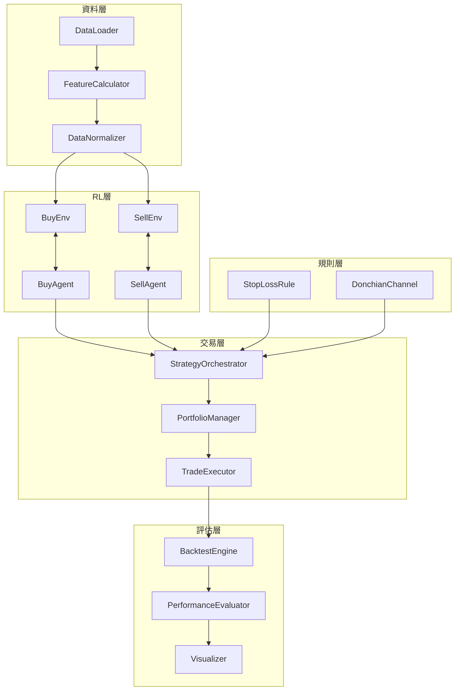
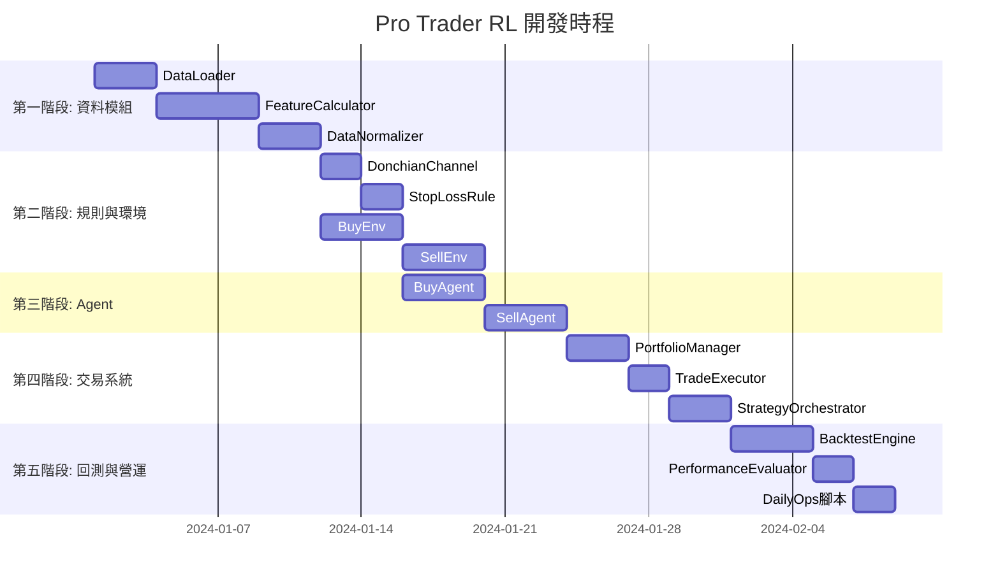

# Pro Trader RL 專案架構規劃

## 專案設定

| 項目 | 設定值 |
|------|--------|
| **專案位置** | `d:\000-github-repositories\ptrl-v01` |
| **資料集** | S&P 500 (約 500 支股票) |
| **指數基準** | S&P 500 指數 (^GSPC) |
| **資料來源** | yfinance |
| **快取機制** | CSV 檔案 (原始資料 + 處理後特徵) |
| **正規化公式** | 採用修正版 (詳見下方說明) |
| **報酬率公式** | 標準金融公式 `(Sell-Buy)/Buy` |

---

## 目標

根據論文內容，建立一個模組化、可維護、支援多種回測配置與每日營運的 Pro Trader RL 實作框架。

---

## 專案目錄結構

```
d:\000-github-repositories\ptrl-v01\
├── config/                          # 設定檔目錄
│   ├── default_config.yaml          # 預設參數設定
│   ├── backtest_configs/            # 回測設定檔
│   │   ├── experiment1.yaml         # 實驗一設定
│   │   └── custom_strategy.yaml     # 自訂策略設定
│   └── live_config.yaml             # 每日營運設定
│
├── data/                            # 資料目錄
│   ├── raw/                         # 原始下載資料
│   ├── processed/                   # 處理後的特徵資料
│   └── cache/                       # 快取資料
│
├── models/                          # 訓練好的模型
│   ├── buy_agent/                   # Buy Knowledge RL 模型
│   ├── sell_agent/                  # Sell Knowledge RL 模型
│   └── checkpoints/                 # 訓練檢查點
│
├── logs/                            # 日誌目錄
│   ├── training/                    # 訓練日誌
│   ├── backtest/                    # 回測日誌
│   └── daily_ops/                   # 每日營運日誌
│
├── outputs/                         # 輸出結果
│   ├── reports/                     # 績效報告
│   ├── trades/                      # 交易紀錄
│   └── plots/                       # 圖表
│
├── src/                             # 核心程式碼
│   ├── __init__.py
│   ├── data/                        # 資料模組
│   │   ├── __init__.py
│   │   ├── data_loader.py           # 資料下載器
│   │   ├── feature_calculator.py    # 特徵計算器
│   │   └── normalizer.py            # 資料正規化器
│   │
│   ├── environments/                # RL 環境模組
│   │   ├── __init__.py
│   │   ├── base_env.py              # 環境基底類別
│   │   ├── buy_env.py               # Buy Knowledge RL 環境
│   │   └── sell_env.py              # Sell Knowledge RL 環境
│   │
│   ├── agents/                      # RL Agent 模組
│   │   ├── __init__.py
│   │   ├── base_agent.py            # Agent 基底類別
│   │   ├── buy_agent.py             # Buy Knowledge Agent
│   │   └── sell_agent.py            # Sell Knowledge Agent
│   │
│   ├── rules/                       # 規則模組
│   │   ├── __init__.py
│   │   ├── stop_loss.py             # 停損規則
│   │   └── donchian_channel.py      # Donchian Channel 策略
│   │
│   ├── trading/                     # 交易系統模組
│   │   ├── __init__.py
│   │   ├── portfolio_manager.py     # 投資組合管理器
│   │   ├── trade_executor.py        # 交易執行器
│   │   └── strategy_orchestrator.py # 策略整合器
│   │
│   ├── backtest/                    # 回測模組
│   │   ├── __init__.py
│   │   ├── backtest_engine.py       # 回測引擎
│   │   └── performance_evaluator.py # 績效評估器
│   │
│   └── utils/                       # 工具模組
│       ├── __init__.py
│       ├── config_loader.py         # 設定檔載入器
│       ├── logger.py                # 日誌工具
│       └── visualizer.py            # 視覺化工具
│
├── scripts/                         # 執行腳本
│   ├── train_buy_agent.py           # 訓練 Buy Agent
│   ├── train_sell_agent.py          # 訓練 Sell Agent
│   ├── run_backtest.py              # 執行回測
│   └── daily_ops.py                 # 每日營運腳本
│
├── tests/                           # 測試
│   ├── test_data_loader.py
│   ├── test_feature_calculator.py
│   ├── test_environments.py
│   └── test_backtest.py
│
├── requirements.txt
└── README.md
```

---

## 核心模組介面設計

### 1. DataLoader (資料下載器)

```python
class DataLoader:
    """
    下載並管理股票資料
    - 使用 yfinance 下載 S&P 500 成分股資料
    - 下載後自動存為 CSV 快取
    - 更新時僅下載新資料並附加到現有 CSV
    """
    
    def __init__(self, config: dict):
        self.data_dir = config['data_dir']          # data/raw/
        self.processed_dir = config['processed_dir'] # data/processed/
        self.index_symbol = config.get('index_symbol', '^DJI')
    
    # === 資料下載 ===
    def download_all(self, start_date: str, end_date: str) -> dict:
        """
        下載所有 S&P 500 成分股資料
        Returns: {symbol: pd.DataFrame}
        """
        pass
    
    def download_symbol(self, symbol: str, start_date: str, end_date: str) -> pd.DataFrame:
        """下載單一股票資料並存為 CSV"""
        pass
    
    def download_index(self, start_date: str, end_date: str) -> pd.DataFrame:
        """下載指數資料 (道瓊指數)"""
        pass
    
    # === 資料更新 ===
    def update_all(self) -> dict:
        """
        更新所有股票至最新日期
        - 讀取現有 CSV 的最後日期
        - 只下載新資料並附加
        """
        pass
    
    def update_symbol(self, symbol: str) -> pd.DataFrame:
        """更新單一股票資料"""
        pass
    
    # === 資料載入 ===
    def load_symbol(self, symbol: str) -> pd.DataFrame:
        """從 CSV 載入單一股票資料"""
        csv_path = os.path.join(self.data_dir, f'{symbol}.csv')
        return pd.read_csv(csv_path, parse_dates=['Date'], index_col='Date')
    
    def load_all(self) -> dict:
        """載入所有已下載的股票資料"""
        pass
    
    def load_index(self) -> pd.DataFrame:
        """載入指數資料"""
        pass
    
    # === S&P 500 成分股管理 ===
    def get_sp500_symbols(self) -> list:
        """
        從 Wikipedia 取得最新 S&P 500 成分股清單
        並存為 config/sp500_symbols.txt
        """
        pass
    
    def load_symbols_list(self) -> list:
        """從本地檔案載入股票清單"""
        pass
    
    # === 快取管理 ===
    def get_cache_status(self) -> pd.DataFrame:
        """
        取得快取狀態報告
        Returns: DataFrame with columns [symbol, start_date, end_date, rows, file_size]
        """
        pass
    
    def clear_cache(self, symbol: str = None):
        """清除快取 (指定股票或全部)"""
        pass
```

**CSV 檔案結構**:
```
data/raw/
├── AAPL.csv          # 個股 OHLCV 資料
├── MSFT.csv
├── GOOGL.csv
├── ...
├── DJI.csv           # 道瓊指數資料
└── cache_status.json # 快取狀態紀錄

data/processed/
├── AAPL_features.csv # 計算後的特徵資料
├── MSFT_features.csv
└── ...
```

---

### 2. FeatureCalculator (特徵計算器)

```python
class FeatureCalculator:
    """計算論文中定義的 69 個特徵"""
    
    def __init__(self, config: dict):
        self.atr_period = config.get('atr_period', 10)
        self.donchian_period = config.get('donchian_period', 20)
        # ... 其他參數
    
    def calculate_all_features(self, df: pd.DataFrame) -> pd.DataFrame:
        """計算所有 69 個特徵"""
        pass
    
    def calculate_basic_features(self, df: pd.DataFrame) -> pd.DataFrame:
        """計算 9 個基本變數"""
        pass
    
    def calculate_technical_indicators(self, df: pd.DataFrame) -> pd.DataFrame:
        """計算 21 個技術指標"""
        pass
    
    def calculate_index_features(self, df: pd.DataFrame, 
                                  index_df: pd.DataFrame) -> pd.DataFrame:
        """計算 13 個指數變數"""
        pass
    
    def calculate_relative_strength(self, df: pd.DataFrame,
                                     index_df: pd.DataFrame) -> pd.DataFrame:
        """計算 26 個相對強度變數"""
        pass
```

---

### 3. DataNormalizer (資料正規化器)

```python
class DataNormalizer:
    """實作論文中的正規化公式"""
    
    def normalize(self, df: pd.DataFrame) -> pd.DataFrame:
        """執行所有正規化"""
        pass
    
    def normalize_price_ratios(self, df: pd.DataFrame) -> pd.DataFrame:
        """價格比率正規化 (公式 1-8)"""
        pass
    
    def normalize_temporal_ratios(self, df: pd.DataFrame) -> pd.DataFrame:
        """時間差正規化 (公式 9-10)"""
        pass
    
    def normalize_minmax(self, df: pd.DataFrame) -> pd.DataFrame:
        """最大最小值正規化 (公式 11-15)"""
        pass
    
    def normalize_percentages(self, df: pd.DataFrame) -> pd.DataFrame:
        """百分比正規化 (公式 16-18)"""
        pass
```

---

### 4. BuyEnv & BuyAgent (買入知識 RL)

```python
class BuyEnv(gym.Env):
    """Buy Knowledge RL 環境"""
    
    def __init__(self, data: pd.DataFrame, config: dict):
        self.action_space = spaces.Discrete(2)  # Action 1 or 2
        self.observation_space = spaces.Box(...)  # 69 維
        self.success_threshold = config.get('success_threshold', 0.10)
    
    def reset(self) -> np.ndarray:
        """重置環境，回傳初始狀態"""
        pass
    
    def step(self, action: int) -> Tuple[np.ndarray, float, bool, dict]:
        """執行動作，回傳 (state, reward, done, info)"""
        pass
    
    def get_buy_signals(self, df: pd.DataFrame) -> pd.DataFrame:
        """從 Donchian Channel 策略產生買入訊號"""
        pass


class BuyAgent:
    """
    Buy Knowledge RL Agent
    
    功能特點:
    - 定期儲存檢查點 (checkpoint)
    - 支援從檢查點恢復訓練
    - 訓練期間追蹤並保存最佳模型
    - TensorBoard 即時監控訓練過程
    - 使用 Stable-Baselines3 + Callbacks
    """
    
    def __init__(self, config: dict):
        self.model = None
        self.config = config
        self.checkpoint_dir = config.get('checkpoint_dir', 'models/checkpoints/buy_agent/')
        self.best_model_dir = config.get('best_model_dir', 'models/buy_agent/')
        self.checkpoint_freq = config.get('checkpoint_freq', 10000)  # 每 N 步存一次
        self.tensorboard_log = config.get('tensorboard_log', 'logs/training/buy_agent/')
    
    # === 訓練相關 ===
    def train(self, env: BuyEnv, total_timesteps: int, resume: bool = False):
        """
        訓練 Agent
        Args:
            env: 訓練環境
            total_timesteps: 總訓練步數
            resume: 是否從最新檢查點恢復訓練
        
        TensorBoard 啟動方式:
            tensorboard --logdir=logs/training/buy_agent/
        """
        pass
    
    def _create_callbacks(self) -> list:
        """
        建立訓練 Callbacks
        - CheckpointCallback: 定期儲存檢查點
        - EvalCallback: 評估並保存最佳模型 + Early Stopping
        - TensorBoardCallback: 自訂指標記錄
        """
        pass
    
    def get_latest_checkpoint(self) -> str:
        """取得最新的檢查點路徑"""
        pass
    
    def get_training_progress(self) -> dict:
        """
        取得訓練進度
        Returns: {
            'total_timesteps': int,
            'current_timesteps': int,
            'best_reward': float,
            'last_checkpoint': str
        }
        """
        pass
    
    # === 模型儲存/載入 ===
    def save(self, path: str):
        """儲存模型"""
        pass
    
    def load(self, path: str):
        """載入模型"""
        pass
    
    def load_best_model(self):
        """載入最佳模型"""
        best_path = os.path.join(self.best_model_dir, 'best_model.zip')
        self.load(best_path)
    
    def load_checkpoint(self, checkpoint_path: str = None):
        """
        載入檢查點 (預設載入最新)
        Args:
            checkpoint_path: 指定檢查點路徑，None 則載入最新
        """
        pass
    
    # === 預測相關 ===
    def predict(self, state: np.ndarray) -> Tuple[int, float]:
        """預測動作與機率"""
        pass
    
    def select_top_stocks(self, predictions: pd.DataFrame, 
                          top_n: int = 10) -> list:
        """選擇機率最高的前 N 支股票"""
        pass
```

**檢查點與最佳模型目錄結構**:
```
models/
├── buy_agent/
│   └── best_model.zip           # 訓練期間最佳模型
├── sell_agent/
│   └── best_model.zip
└── checkpoints/
    ├── buy_agent/
    │   ├── rl_model_10000_steps.zip
    │   ├── rl_model_20000_steps.zip
    │   ├── rl_model_30000_steps.zip
    │   └── training_state.json  # 記錄總步數、最佳獎勵等
    └── sell_agent/
        └── ...
```

---

### 5. SellEnv & SellAgent (賣出知識 RL)

```python
class SellEnv(gym.Env):
    """Sell Knowledge RL 環境"""
    
    def __init__(self, data: pd.DataFrame, config: dict):
        self.action_space = spaces.Discrete(2)  # Sell or Hold
        self.observation_space = spaces.Box(...)  # 70 維 (69 + 報酬率)
        self.max_holding_days = config.get('max_holding_days', 120)
    
    def reset(self) -> np.ndarray:
        pass
    
    def step(self, action: int) -> Tuple[np.ndarray, float, bool, dict]:
        pass
    
    def calculate_relative_reward(self, returns: list) -> float:
        """計算相對獎勵 (公式 21)"""
        pass


class SellAgent:
    """
    Sell Knowledge RL Agent
    
    功能特點:
    - 定期儲存檢查點 (checkpoint)
    - 支援從檢查點恢復訓練
    - 訓練期間追蹤並保存最佳模型
    - TensorBoard 即時監控訓練過程
    - 使用 Stable-Baselines3 + Callbacks
    """
    
    def __init__(self, config: dict):
        self.model = None
        self.config = config
        self.sell_threshold = config.get('sell_threshold', 0.85)
        self.checkpoint_dir = config.get('checkpoint_dir', 'models/checkpoints/sell_agent/')
        self.best_model_dir = config.get('best_model_dir', 'models/sell_agent/')
        self.checkpoint_freq = config.get('checkpoint_freq', 10000)
        self.tensorboard_log = config.get('tensorboard_log', 'logs/training/sell_agent/')
    
    # === 訓練相關 ===
    def train(self, env: SellEnv, total_timesteps: int, resume: bool = False):
        """
        訓練 Agent
        Args:
            env: 訓練環境
            total_timesteps: 總訓練步數
            resume: 是否從最新檢查點恢復訓練
        
        TensorBoard 啟動方式:
            tensorboard --logdir=logs/training/sell_agent/
        """
        pass
    
    def _create_callbacks(self) -> list:
        """建立訓練 Callbacks (含 TensorBoard)"""
        pass
    
    def get_latest_checkpoint(self) -> str:
        """取得最新的檢查點路徑"""
        pass
    
    def get_training_progress(self) -> dict:
        """取得訓練進度"""
        pass
    
    # === 模型儲存/載入 ===
    def save(self, path: str):
        pass
    
    def load(self, path: str):
        pass
    
    def load_best_model(self):
        """載入最佳模型"""
        best_path = os.path.join(self.best_model_dir, 'best_model.zip')
        self.load(best_path)
    
    def load_checkpoint(self, checkpoint_path: str = None):
        """載入檢查點 (預設載入最新)"""
        pass
    
    # === 預測相關 ===
    def predict(self, state: np.ndarray) -> Tuple[int, float, float]:
        """預測動作，回傳 (action, sell_prob, hold_prob)"""
        pass
    
    def should_sell(self, sell_prob: float, hold_prob: float) -> bool:
        """判斷是否應該賣出"""
        return abs(sell_prob - hold_prob) > self.sell_threshold and sell_prob > hold_prob
```

---

### 6. StopLossRule (停損規則)

```python
class StopLossRule:
    """停損規則管理器"""
    
    def __init__(self, config: dict):
        self.dip_threshold = config.get('dip_threshold', -0.10)
        self.sideways_days = config.get('sideways_days', 20)
        self.sideways_threshold = config.get('sideways_threshold', 0.10)
        self.max_holding_days = config.get('max_holding_days', 120)
    
    def check_stop_loss(self, position: dict, current_price: float) -> Tuple[bool, str]:
        """
        檢查是否觸發停損
        Returns: (should_stop, reason)
        """
        pass
    
    def check_dip_stop(self, buy_price: float, current_price: float) -> bool:
        """檢查跌幅停損"""
        return (current_price - buy_price) / buy_price < self.dip_threshold
    
    def check_sideways_stop(self, returns_history: list) -> bool:
        """檢查盤整停損"""
        low_return_days = sum(1 for r in returns_history if r <= self.sideways_threshold)
        return low_return_days >= self.sideways_days
```

---

### 7. PortfolioManager & TradeExecutor (交易系統)

```python
class PortfolioManager:
    """投資組合管理器"""
    
    def __init__(self, config: dict):
        self.initial_capital = config.get('initial_capital', 10000)
        self.max_positions = config.get('max_positions', 10)
        self.max_position_pct = config.get('max_position_pct', 0.10)
        self.trading_fee = config.get('trading_fee', 0.001)
        
        self.cash = self.initial_capital
        self.positions = {}  # {symbol: Position}
    
    def get_available_capital(self) -> float:
        """取得可用資金"""
        pass
    
    def can_open_position(self) -> bool:
        """檢查是否可以開新倉位"""
        return len(self.positions) < self.max_positions
    
    def calculate_position_size(self, price: float) -> int:
        """計算倉位大小"""
        pass
    
    def get_portfolio_value(self, prices: dict) -> float:
        """計算投資組合總價值"""
        pass


class TradeExecutor:
    """交易執行器"""
    
    def __init__(self, portfolio: PortfolioManager, config: dict):
        self.portfolio = portfolio
    
    def execute_buy(self, symbol: str, price: float, date: str) -> dict:
        """執行買入"""
        pass
    
    def execute_sell(self, symbol: str, price: float, date: str, 
                     reason: str) -> dict:
        """執行賣出"""
        pass
    
    def get_trade_history(self) -> pd.DataFrame:
        """取得交易歷史"""
        pass
```

---

### 8. StrategyOrchestrator (策略整合器)

```python
class StrategyOrchestrator:
    """整合所有模組的策略執行器"""
    
    def __init__(self, config: dict):
        self.data_loader = DataLoader(config)
        self.feature_calc = FeatureCalculator(config)
        self.normalizer = DataNormalizer()
        self.buy_agent = BuyAgent(config)
        self.sell_agent = SellAgent(config)
        self.stop_loss = StopLossRule(config)
        self.portfolio = PortfolioManager(config)
        self.executor = TradeExecutor(self.portfolio, config)
    
    def run_daily(self, date: str) -> dict:
        """執行每日交易決策"""
        pass
    
    def process_buy_signals(self, date: str) -> list:
        """處理買入訊號"""
        pass
    
    def process_positions(self, date: str) -> list:
        """處理現有持倉 (賣出/停損判斷)"""
        pass
    
    def generate_report(self, date: str) -> dict:
        """產生每日報告"""
        pass
```

---

### 9. BacktestEngine (回測引擎)

```python
class BacktestEngine:
    """回測引擎"""
    
    def __init__(self, config: dict):
        self.orchestrator = StrategyOrchestrator(config)
        self.start_date = config['backtest']['start_date']
        self.end_date = config['backtest']['end_date']
    
    def run(self) -> dict:
        """執行回測"""
        pass
    
    def run_single_day(self, date: str) -> dict:
        """執行單日回測"""
        pass
    
    def get_results(self) -> pd.DataFrame:
        """取得回測結果"""
        pass


class PerformanceEvaluator:
    """績效評估器"""
    
    def __init__(self):
        pass
    
    def calculate_annual_return(self, returns: pd.Series) -> float:
        """計算年化報酬"""
        pass
    
    def calculate_cumulative_return(self, returns: pd.Series) -> float:
        """計算累積報酬"""
        pass
    
    def calculate_sharpe_ratio(self, returns: pd.Series, 
                                risk_free_rate: float = 0.02) -> float:
        """計算 Sharpe Ratio"""
        pass
    
    def calculate_mdd(self, portfolio_values: pd.Series) -> float:
        """計算最大回撤 (MDD)"""
        pass
    
    def generate_report(self, backtest_results: dict) -> dict:
        """產生完整績效報告"""
        pass
```

---

## 設定檔結構 (YAML)

```yaml
# config/default_config.yaml

data:
  data_dir: "data/"
  symbols_file: "sp500_symbols.txt"
  start_date: "2005-02-25"
  end_date: "2023-10-15"
  index_symbol: "^DJI"

features:
  atr_period: 10
  donchian_period: 20
  rsi_period: 14
  mfi_period: 14
  super_trend_periods: [14, 21]
  super_trend_multipliers: [2, 1]

buy_agent:
  success_threshold: 0.10
  algorithm: "PPO"
  learning_rate: 0.0001
  n_steps: 2048
  batch_size: 64
  gamma: 0.99
  gae_lambda: 0.95
  clip_range: 0.2
  ent_coef: 0.01
  vf_coef: 0.5
  hidden_layers: [69, 40, 2]
  # 訓練與檢查點設定
  total_timesteps: 1000000          # 總訓練步數
  checkpoint_freq: 10000            # 每 N 步存一次檢查點
  eval_freq: 5000                   # 每 N 步評估一次
  n_eval_episodes: 10               # 評估時的 episode 數
  early_stop_patience: 50           # 連續 N 次評估未改善則停止

sell_agent:
  success_threshold: 0.10
  max_holding_days: 120
  sell_threshold: 0.85
  algorithm: "PPO"
  learning_rate: 0.0001
  n_steps: 2048
  batch_size: 64
  gamma: 0.99
  gae_lambda: 0.95
  clip_range: 0.2
  ent_coef: 0.01
  vf_coef: 0.5
  hidden_layers: [70, 40, 2]
  # 訓練與檢查點設定
  total_timesteps: 1000000
  checkpoint_freq: 10000
  eval_freq: 5000
  n_eval_episodes: 10
  early_stop_patience: 50

training:
  # 模型儲存路徑
  checkpoint_dir: "models/checkpoints/"
  best_model_dir: "models/"
  # 日誌設定
  tensorboard_log: "logs/training/"
  verbose: 1
  # 早停設定
  use_early_stopping: true

stop_loss:
  dip_threshold: -0.10
  sideways_days: 20
  sideways_threshold: 0.10

portfolio:
  initial_capital: 10000
  max_positions: 10
  max_position_pct: 0.10
  trading_fee: 0.001

backtest:
  start_date: "2017-10-16"
  end_date: "2023-10-15"
  train_end_date: "2017-10-15"
```

---

## 模組協作流程圖



---

## TensorBoard 即時監控

TensorBoard 用於即時監控訓練過程，追蹤以下指標：

### 監控指標

| 指標 | 說明 |
|------|------|
| `rollout/ep_rew_mean` | 平均 Episode 獎勵 |
| `rollout/ep_len_mean` | 平均 Episode 長度 |
| `train/loss` | 訓練損失 |
| `train/policy_loss` | 策略損失 |
| `train/value_loss` | 價值函數損失 |
| `train/entropy_loss` | 熵損失 |
| `train/approx_kl` | 近似 KL 散度 |
| `eval/mean_reward` | 評估平均獎勵 (用於選擇最佳模型) |

### 使用方式

```bash
# 啟動 TensorBoard (監控所有訓練)
tensorboard --logdir=logs/training/

# 只監控 Buy Agent
tensorboard --logdir=logs/training/buy_agent/

# 只監控 Sell Agent
tensorboard --logdir=logs/training/sell_agent/

# 指定 port
tensorboard --logdir=logs/training/ --port=6006
```

### 日誌目錄結構

```
logs/training/
├── buy_agent/
│   ├── PPO_1/
│   │   └── events.out.tfevents.xxx
│   └── PPO_2/  (接續訓練會建立新目錄)
└── sell_agent/
    └── PPO_1/
```

> **提示**: 訓練期間開啟瀏覽器訪問 `http://localhost:6006` 即可即時查看訓練曲線

## 每日營運腳本架構

```python
# scripts/daily_ops.py

def main():
    # 1. 載入設定
    config = load_config('config/live_config.yaml')
    
    # 2. 初始化策略整合器
    orchestrator = StrategyOrchestrator(config)
    
    # 3. 載入訓練好的模型
    orchestrator.buy_agent.load('models/buy_agent/best_model.zip')
    orchestrator.sell_agent.load('models/sell_agent/best_model.zip')
    
    # 4. 更新資料
    orchestrator.data_loader.update()
    
    # 5. 執行今日交易決策
    today = datetime.now().strftime('%Y-%m-%d')
    decisions = orchestrator.run_daily(today)
    
    # 6. 輸出報告
    report = orchestrator.generate_report(today)
    save_report(report, f'outputs/reports/{today}.json')
    
    # 7. 記錄日誌
    logger.info(f"Daily ops completed: {decisions}")

if __name__ == '__main__':
    main()
```

---

## 驗證計畫

### 1. 單元測試

| 測試項目 | 測試內容 | 執行方式 |
|----------|----------|----------|
| test_feature_calculator | 驗證 69 個特徵計算正確性 | `pytest tests/test_feature_calculator.py` |
| test_normalizer | 驗證正規化公式 1-18 | `pytest tests/test_normalizer.py` |
| test_environments | 驗證 RL 環境運作 | `pytest tests/test_environments.py` |
| test_stop_loss | 驗證停損規則邏輯 | `pytest tests/test_stop_loss.py` |

### 2. 整合測試

| 測試項目 | 測試內容 | 執行方式 |
|----------|----------|----------|
| test_backtest_workflow | 完整回測流程 | `pytest tests/test_backtest.py` |
| test_daily_ops_workflow | 每日營運流程 | `pytest tests/test_daily_ops.py` |

### 3. 論文結果重現驗證

1. **訓練期間**: 2005/02/25 ~ 2017/10/15
2. **測試期間**: 2017/10/16 ~ 2023/10/15
3. **預期指標**:
   - 年化報酬: ~65%
   - 累積報酬: ~1936%
   - Sharpe Ratio: ~4.5
   - MDD: <10%

---

## 開發順序建議



---

## 使用範例

### 執行回測

```bash
python scripts/run_backtest.py --config config/backtest_configs/experiment1.yaml
```

### 訓練模型

```bash
python scripts/train_buy_agent.py --config config/default_config.yaml
python scripts/train_sell_agent.py --config config/default_config.yaml
```

### 每日營運

```bash
python scripts/daily_ops.py --config config/live_config.yaml
```
