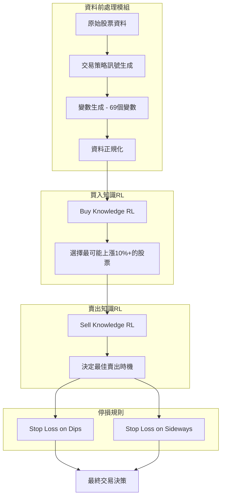
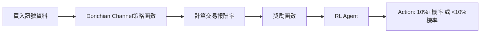
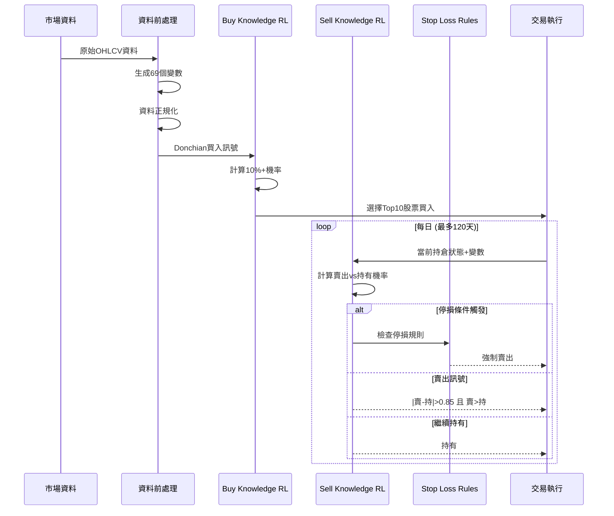

# Pro Trader RL 論文深度分析

**論文標題**: Pro Trader RL: Reinforcement learning framework for generating trading knowledge by mimicking the decision-making patterns of professional traders

**出處**: Expert Systems With Applications 254 (2024) 124465

**作者**: Da Woon Jeong, Yeong Hyeon Gu (世宗大學)

---

## 1. 核心架構總覽

Pro Trader RL 是一個模仿專業交易員決策模式的強化學習框架，由 **四個主要模組** 組成：



---

## 2. 資料前處理模組 (Data Preprocessing)

### 2.1 資料集設定

| 項目 | 設定值 |
|------|--------|
| 資料來源 | S&P 500 + S&P MidCap 400 + S&P SmallCap 600 |
| 股票數量 | 1,465 支 |
| 資料來源 | Yahoo Finance (日線資料) |
| 最低資料要求 | 至少 2 年的歷史資料 |

### 2.2 交易策略訊號生成 - Donchian Channel 策略

```
買入訊號條件:
  當日最高價 > Upper Channel (過去20天最高價)
  且前一天沒有買入訊號

賣出訊號條件:
  當日最低價 < Lower Channel (過去20天最低價)
  且已經持有部位
```

### 2.3 輸入變數設計 (共 69 個變數)

#### 2.3.1 基本變數 (9個)

| 變數名稱 | 說明 |
|----------|------|
| Open | 開盤價 |
| High | 最高價 |
| Low | 最低價 |
| Close | 收盤價 |
| Volume | 成交量 |
| HA Open | 平均K線開盤價 |
| HA High | 平均K線最高價 |
| HA Low | 平均K線最低價 |
| HA Close | 平均K線收盤價 |

#### 2.3.2 技術指標變數 (21個)

| 變數名稱 | 參數設定 | 說明 |
|----------|----------|------|
| Return | - | 當日報酬率 (今收 - 昨收) |
| ATR | N=10 | 平均真實波幅 |
| Stock(N) | N=1~12 | 當前ATR與N個月前ATR的比較 |
| Super Trend | N=14,21; 乘數=2,1 | 趨勢追蹤指標 |
| MFI | N=14 | 資金流量指標 |
| RSI | N=14 | 相對強弱指標 |
| Donchian Upper | N=20 | 唐奇安通道上軌 |
| Donchian Lower | N=20 | 唐奇安通道下軌 |
| AVG Stock | - | Stock(1~12) 的平均值 |

#### 2.3.3 股票指數變數 (13個)

| 變數名稱 | 說明 |
|----------|------|
| DJI ATR | 道瓊指數的 ATR (N=10) |
| Index(N) | 當前 DJI ATR 與 N 個月前的比較 (N=1~12) |

#### 2.3.4 個股 vs 指數變數 (26個)

| 變數名稱 | 說明 |
|----------|------|
| RS(N) | 相對強度 = Stock(N) / Index(N)，N=1~12 |
| RS AVG | RS 的移動平均，N=2,4,6,8,10,12 |
| RS Rate | RS 轉換為 0~100 的數值 |
| RS Rate(N) | RS Rate 的移動平均，N=5,10,20,40 |
| Up Stock | 報酬為正的股票數量 |
| Down Stock | 報酬為負的股票數量 |

### 2.4 資料正規化公式

#### 利用變數差異的正規化

```python
# 價格相關正規化
Donchian_Upper_new = Donchian_Upper / High
Donchian_Lower_new = Donchian_Lower / Low
Close_new = Donchian_Upper / High
Low_new = Donchian_Upper / High
High_new = Donchian_Upper / High
HA_Close_new = Donchian_Upper / High
HA_Low_new = Donchian_Upper / High
HA_High_new = Donchian_Upper / High
```

#### 利用前一天資料的正規化

```python
DJI_ATR_new = DJI_ATR[t] / DJI_ATR[t-1]
ATR_new = ATR[t] / ATR[t-1]
```

#### 利用最大最小值的正規化

```python
Index_new = (Index - min(Index_1~12)) / (max(Index_1~12) - min(Index_1~12))
Stock_new = (Stock - min(Stock_1~12)) / (max(Stock_1~12) - min(Stock_1~12))
AVG_Stock_new = (AVG_Stock - min(Stock_1~12)) / (max(Stock_1~12) - min(Stock_1~12))
RS_new = (RS - min(RS_1~12, RS_AVG_2,4,6,8,10,12)) / (max(...) - min(...))
RS_AVG_new = (RS_AVG - min(RS_1~12, RS_AVG_...)) / (max(...) - min(...))
```

#### 百分比值正規化

```python
RS_Rate_new = RS_Rate * 0.01
MFI_new = MFI * 0.01
RSI_new = RSI * 0.01
```

> [!NOTE]
> Super Trend、Return、Up Stock、Down Stock 已經是正規化值，不需額外處理。Open、HA Open 用於正規化計算，Volume 正規化複雜，故皆從 RL 輸入變數中排除。

---

## 3. Buy Knowledge RL (買入知識強化學習)

### 3.1 環境設計



### 3.2 報酬率計算公式

```python
Signal_Return = (Sell_Signal_Open[t+1] - Buy_Signal_Open[t+1]) / Sell_Signal_Open[t+1]
```

### 3.3 動作定義

| 動作 | 定義 |
|------|------|
| Action 1 | 預測報酬率 ≥ 10% |
| Action 2 | 預測報酬率 < 10% |

### 3.4 獎勵機制

| 情境 | 條件 | 獎勵 |
|------|------|------|
| Scenario 1 | Action 1 機率高 + 實際報酬 ≥ 10% | **+1** |
| Scenario 2 | Action 1 機率高 + 實際報酬 < 10% | 0 |
| Scenario 3 | Action 2 機率高 + 實際報酬 < 10% | **+1** |
| Scenario 4 | Action 2 機率高 + 實際報酬 ≥ 10% | 0 |

### 3.5 訓練模式 vs 測試模式

**訓練模式 (Train Mode)**:
- 使用 Donchian Channel 策略產生的買入訊號資料
- 報酬 ≥10% 與 <10% 的資料 **平衡採樣**
- 確保學習不偏向單一方向

**測試模式 (Test Mode)**:
- 載入訓練好的 RL Agent
- 輸出報酬 ≥10% 的機率
- **股票選擇模組**: 相同日期的股票合併，選擇機率最高的前 10 支

### 3.6 神經網路架構

```
Policy Network (DNN):
├── 輸入層: 69 個神經元 (正規化後的變數)
├── 隱藏層 1: 69 個神經元
├── 隱藏層 2: 40 個神經元
├── 隱藏層 3: 2 個神經元
└── 輸出層: 2 個機率值 (Action 1 & Action 2)

Actor Network 與 Critic Network 結構相同
```

---

## 4. Sell Knowledge RL (賣出知識強化學習)

### 4.1 環境設計


### 4.2 報酬率計算公式

```python
Sell_Return = Open[t] / Buy_Signal_Open[t+1]
```

### 4.3 動作定義

| 動作 | 定義 |
|------|------|
| Action 1 | 賣出 (Sell) |
| Action 2 | 持有 (Hold) |

### 4.4 相對獎勵機制

**Sell Knowledge RL 特色**: 使用 **相對獎勵** 而非固定獎勵

```python
# 相對獎勵計算公式
Sell_Knowledge_RL_Reward = (報酬≥10%中的排名降序 / 報酬≥10%的總數量) + 1
# 結果範圍: +1 到 +2
```

| 情境 | 條件 | 獎勵 |
|------|------|------|
| Scenario 1 | Action 1 機率高 + 實際報酬 ≥ 10% | **+1 ~ +2** (相對獎勵) |
| Scenario 2 | Action 1 機率高 + 實際報酬 < 10% | **-1** |
| Scenario 3 | Action 2 機率高 + 實際報酬 < 10% | **+0.5** |
| Scenario 4 | Action 2 機率高 + 實際報酬 ≥ 10% | **-1** |

### 4.5 訓練模式 vs 測試模式

**訓練模式 (Train Mode)**:
- 使用買入訊號後 **120 天** 的所有資料
- 資料量 = Buy Knowledge RL 的 **120 倍**
- 排除未達 10% 報酬的資料

**測試模式 (Test Mode)**:
- 最佳賣出時機定義: 
  - `|賣出機率 - 持有機率| > 0.85`
  - 且 `賣出機率 > 持有機率`

### 4.6 神經網路架構

```
Policy Network (DNN):
├── 輸入層: 70 個神經元 (69個變數 + 當前報酬率)
├── 隱藏層 1: 70 個神經元
├── 隱藏層 2: 40 個神經元
├── 隱藏層 3: 2 個神經元
└── 輸出層: 2 個機率值 (Sell & Hold)

Actor Network 與 Critic Network 結構相同
```

---

## 5. Stop Loss Rules (停損規則)

### 5.1 設計理念

> 停損規則與 Sell Knowledge RL **並行運作**，其結果會 **覆蓋** Sell Knowledge RL 的決策。

### 5.2 兩種停損規則

#### Stop Loss on Dips (跌幅停損)

```
條件: 任何時間點報酬率 < -10%
動作: 次日開盤價停損出場
```

#### Stop Loss on Sideways (盤整停損)

```
條件: 在 120 天交易期間內，有 20 天報酬率 ≤ 10%
動作: 第 21 天開盤價停損出場
```

---

## 6. 強化學習演算法與超參數

### 6.1 PPO 演算法設定

| 超參數 | 值 | 說明 |
|--------|-----|------|
| Learning Rate | 0.0001 | 學習率 |
| N Steps | 2,048 | 每次更新的環境步數 |
| Batch Size | 64 | Mini-batch 大小 |
| Entropy Coefficient | 0.01 | 熵係數 (用於探索) |
| Gamma (γ) | 0.99 | 折扣因子 |
| GAE Lambda | 0.95 | 廣義優勢估計因子 |
| Clip Range | 0.2 | PPO 裁剪參數 |
| Value Function Coefficient | 0.5 | 價值函數係數 |

### 6.2 訓練時間

| 模組 | 每 Epoch 時間 | 總 Epoch 數 | 總訓練時間 |
|------|--------------|------------|-----------|
| Buy Knowledge RL | 74.12 秒 | 5,967 | ~122 小時 |
| Sell Knowledge RL | 152.25 秒 | 4,622 | ~195 小時 |

> [!IMPORTANT]
> 兩個模組都使用 **Early Stopping** 來縮短訓練時間

---

## 7. 實驗環境設定

### 7.1 硬體環境

| 項目 | 規格 |
|------|------|
| 作業系統 | Windows 10 |
| CPU | Intel Core i9-9900KF 3.6 GHz |
| GPU | NVIDIA GeForce RTX 2080Ti × 2 |
| RAM | 128 GB |
| 儲存 | 2 TB SSD |

### 7.2 軟體環境

| 套件 | 版本 |
|------|------|
| Python | 3.6.13 |
| PyTorch | 1.8.1 |
| Stable-Baselines3 | 1.3.0 |
| TensorFlow | 2.1.0 |
| OpenAI Gym | 0.19.0 |

### 7.3 交易模擬設定

| 項目 | 設定值 |
|------|--------|
| 初始資金 | $10,000 |
| 最大持股數 | 10 支 |
| 單股最大投資比例 | 10% |
| 交易手續費 | 0.1% |

---

## 8. 實驗結果摘要

### 8.1 實驗一：與傳統策略和機器學習的比較

**測試期間**: 2017/10/16 ~ 2023/10/15

| 系統 | 年化報酬 | 累積報酬 | Sharpe Ratio | MDD |
|------|---------|---------|--------------|-----|
| **Pro Trader RL** | **65.284%** | **1936.801%** | **4.584** | **8.372%** |
| Dow Jones Index | 6.687% | 47.459% | 0.464 | 35.367% |
| Donchian Channel | 7.346% | 52.858% | 0.828 | 49.344% |
| Gaussian Naive Bayes | 31.434% | 415.407% | 1.526 | 36.855% |
| PPO (標準) | -12.722% | -55.844% | 0.059 | 59.667% |
| DQN | -3.788% | -20.76% | 0.949 | 59.965% |
| A2C | 1.057% | 6.404% | 1.005 | 47.429% |

### 8.2 不同市場條件表現

| 市場狀態 | 期間 | Pro Trader RL 年化報酬 | 對比 Dow Jones |
|----------|------|----------------------|----------------|
| 盤整期 1 | 2018/02~2019/10 | **46.134%** | 5.103% |
| 盤整期 2 | 2022/02~2023/05 | **6.689%** | -1.276% |
| 熊市 | 2020/01~2020/07 | **55.996%** | -17.049% |
| 牛市 | 2020/07~2022/01 | **90.331%** | 26.703% |

### 8.3 產業別表現

| 產業 | 平均報酬率 |
|------|-----------|
| 能源 (Energy) | 14.583% |
| 基礎材料 (Basic Materials) | 10.864% |
| 工業 (Industrials) | 9.086% |
| 科技 (Technology) | 8.275% |
| 公用事業 (Utilities) | 1.682% |

---

## 9. 關鍵程式邏輯流程

### 9.1 完整交易決策流程



### 9.2 Buy Knowledge RL 訓練虛擬碼

```python
# 1. 資料準備
signals = donchian_channel_strategy(data, n=20)
buy_signals = signals[signals['signal'] == 'buy']

# 2. 計算報酬率
for signal in buy_signals:
    signal['return'] = calculate_signal_return(signal)
    signal['label'] = 1 if signal['return'] >= 0.10 else 0

# 3. 平衡採樣
positive_samples = buy_signals[buy_signals['label'] == 1]
negative_samples = buy_signals[buy_signals['label'] == 0]
balanced_data = balance_samples(positive_samples, negative_samples)

# 4. PPO 訓練
env = BuyKnowledgeEnv(balanced_data)
model = PPO("MlpPolicy", env, 
            learning_rate=0.0001,
            n_steps=2048,
            batch_size=64,
            gamma=0.99,
            gae_lambda=0.95,
            clip_range=0.2,
            ent_coef=0.01,
            vf_coef=0.5)
model.learn(total_timesteps=n_epochs)
```

### 9.3 Sell Knowledge RL 推論虛擬碼

```python
def decide_sell(current_state, buy_price, days_held, model):
    # 計算當前報酬率
    current_return = (current_price - buy_price) / buy_price
    
    # 檢查停損規則
    if current_return < -0.10:
        return 'STOP_LOSS_DIPS'
    
    if days_with_low_return >= 20:
        return 'STOP_LOSS_SIDEWAYS'
    
    # RL Agent 決策
    state = normalize(current_state + [current_return])
    action_probs = model.predict(state)
    
    sell_prob = action_probs[0]
    hold_prob = action_probs[1]
    
    if abs(sell_prob - hold_prob) > 0.85 and sell_prob > hold_prob:
        return 'SELL'
    else:
        return 'HOLD'
```

---

## 10. 論文貢獻與創新點

1. **模組化設計**: 將專業交易員的決策過程拆分為獨立、互聯的模組
2. **相對獎勵機制**: Sell Knowledge RL 使用相對獎勵而非固定獎勵
3. **整合式風險管理**: Stop Loss Rules 直接內建於框架中
4. **跨市場穩健性**: 在牛市、熊市、盤整市場都能保持正報酬

> [!TIP]
> 這個框架的核心理念是將「買入知識」和「賣出知識」分開學習，各自優化後再整合，而非傳統的單一模型同時學習買賣決策。
